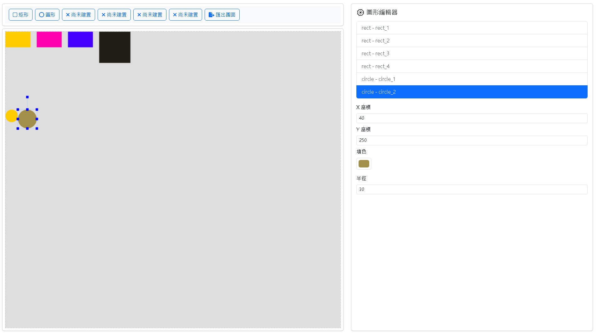

# vue3-hmi-dashboard

🎨 使用 Vue 3 + fabric.js 製作的 HMI 畫布模擬工具  
支援矩形、圓形繪製，將擴充狀態儲存、模擬、匯出功能。

## 🔧 技術架構

- [x] Vue 3 Composition API
- [x] fabric.js 畫布引擎
- [x] Bootstrap 5 UI
- [x] Pinia 狀態管理（Day 3 會實作）
- [x] Vue Router 路由管理
- [x] Vite 開發環境

## 📦 功能進度

| 階段  | 功能                                           | 狀態        |
| ----- | ---------------------------------------------- | ----------- |
| Day 1 | 畫布初始化（背景 / 尺寸）                      | ✅ 已完成   |
| Day 2 | Toolbar + 矩形 / 圓形繪製                      | ✅ 已完成   |
| Day 3 | 圖形資料存入 Pinia + 編輯器同步 + 拖曳縮放綁定 | ✅ 已完成   |
| Day 4 | 狀態模擬頁面 + 切頁資料不丟失                  | ⏳ 暫時不做 |
| Day 5 | 匯出 JSON / 載入功能                           | ⏳ 計畫中   |

## 🗂️ 專案架構說明

```plaintext
📦 src/
├── assets/
├── components/
│   ├── Toolbar.vue            # 左側操作工具列
│   ├── ShapeEditor.vue        # 圖形編輯器總容器
│   ├── CommonShapeEditor.vue  # 共通屬性欄位（x/y 座標、填色）
│   ├── RectEditor.vue         # 矩形專屬屬性表單（width, height）
│   ├── CircleEditor.vue       # 圓形專屬屬性表單（radius）
│   ├── PolygonEditor.vue      # 多邊形編輯表單（點位管理）
├── composables/
│   ├── useCanvas.js           # 初始化與掛載 fabric canvas
│   ├── useShapeManager.js     # 新增圖形並存入 Pinia
│   ├── useShapeEvents.js      # 綁定圖形事件（移動、縮放後更新資料）
│   ├── useCanvasExporter.js   # 匯出 canvas JSON
│   └── fabricDefaults.js      # 共用圖形樣式設定
├── stores/
│   └── shapeStore.js          # Pinia 儲存圖形資料與編輯同步
├── views/
│   └── CanvasView.vue         # 主畫布編輯頁面
├── App.vue
└── main.js
```

## 🖼️ 畫面預覽



## 🚀 安裝與啟動

```bash
git clone https://github.com/你的帳號/vue3-hmi-dashboard.git
cd vue3-hmi-dashboard
npm install
npm run dev
```
